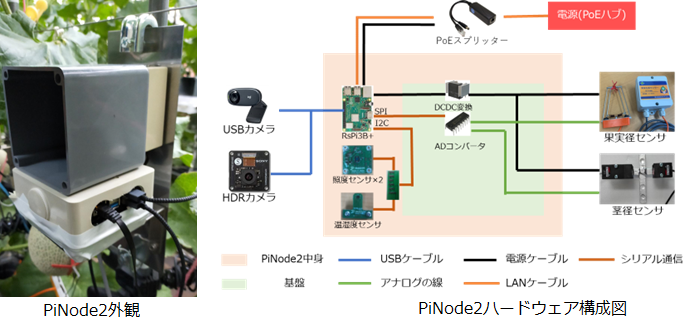

Pinode2
===

Overview


Pinode2とは，屋外で気温や草姿湿度などの環境データや画像収集するためのIoTデータ収集デバイスです．


Pinode2は，Raspberry Pi3，Pinode2専用Hat基板，各種センサ部品で構成されるハードウェアと，センサからデータを取得するソフトウェアから構成されています．

## Description
Fig.1　Pinode2デバイス

## Dependdencies:
* Python 3.8
* numpy 1.24.2
* pandas 1.5.3
* Pillow 8.1.2
* psutil 5.8.0
* pymsteams 0.2.2
* pyserial 3.5b0
* timeout-decorator 0.5.0

## Install
ソフトウェアの設定は，設定全般を担当しているconfig.jsonファイルと優先度通信用の設定ファイルであるconfig.hファイルで管理されています．必要に応じてファイルの内容を設定してください．以下にファイルのパスを記述します．
* 設定 : pinode2/config/config.json

センサ値の収集はi2cを用いて行っています．raspi-configコマンドよりi2cを有効にしてください．
```
$ git clone https://github.com/MinenoLab/pinode2.git
$ cd pinode2

$ sudo bash ./install.sh
$ sudo reboot
```

# Paper
[論文URL](https://tsys.jp/dicomo/2023/program/program_abst.html#3E-2)